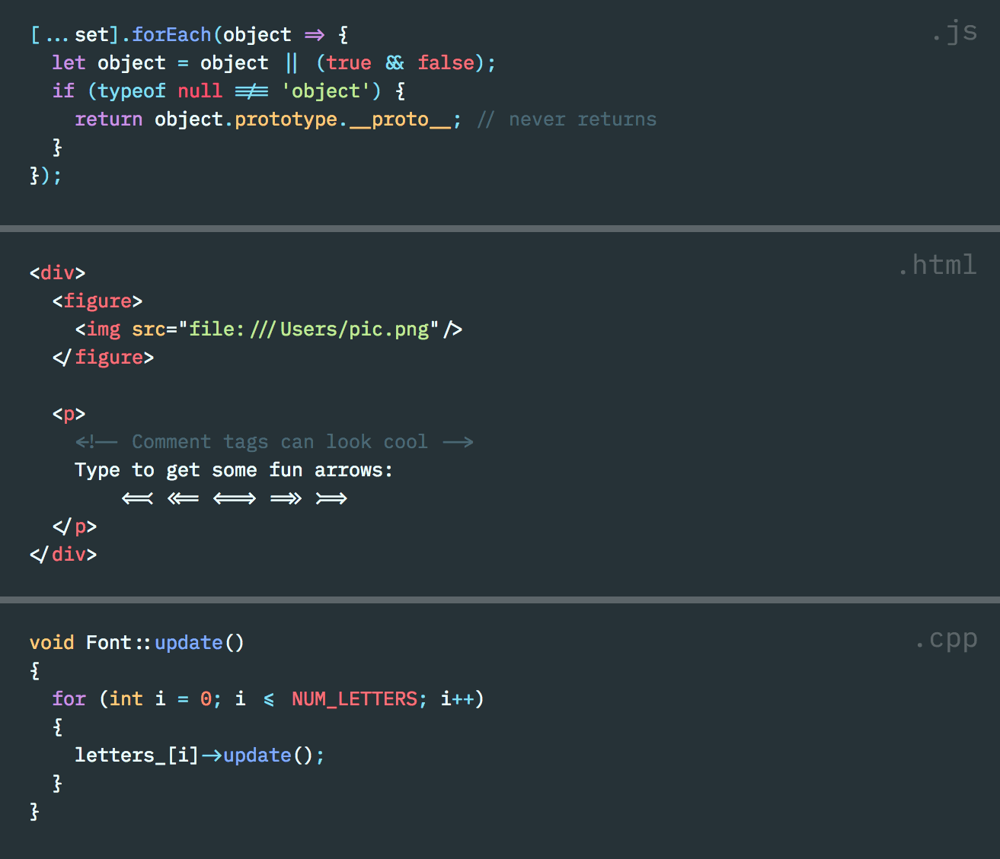

# Plode

**Plode** is a fork of the IBM **Pl**ex Mono typeface designed for use in c**ode** editors.

It adds ligatures for various code tokens such as `!==` or `<!-- -->`.

## License

The vast majority of the included font comes from [IBM Plex Mono][plex], which is

> Copyright © 2017 IBM Corp. with Reserved Font Name "Plex"

This extension of ligatures is released under the same terms as the original:

> This Font Software is licensed under the [SIL Open Font License, Version 1.1](LICENSE).

## Similar Projects

- [Fira Code](https://github.com/tonsky/FiraCode) (a fork of Fira Mono)
- [Hasklig](https://github.com/i-tu/Hasklig) (a fork of Source Code Pro)

[plex]: https://github.com/IBM/plex
